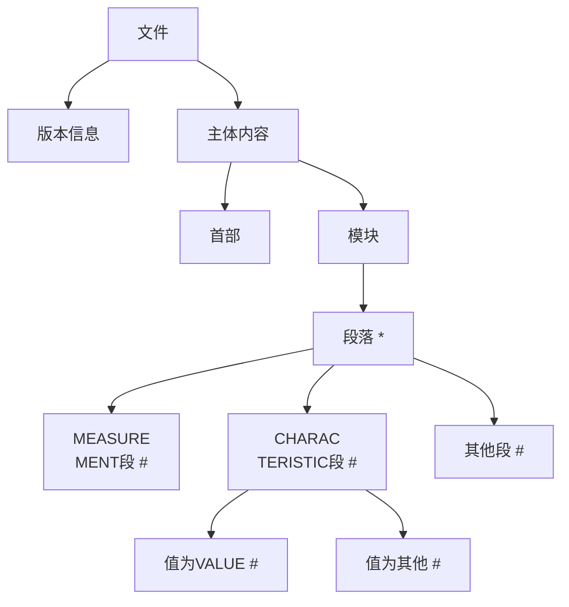
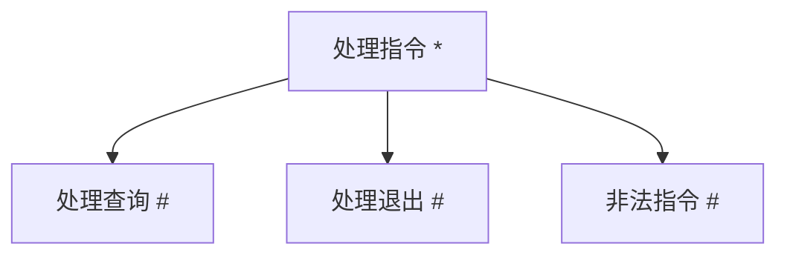
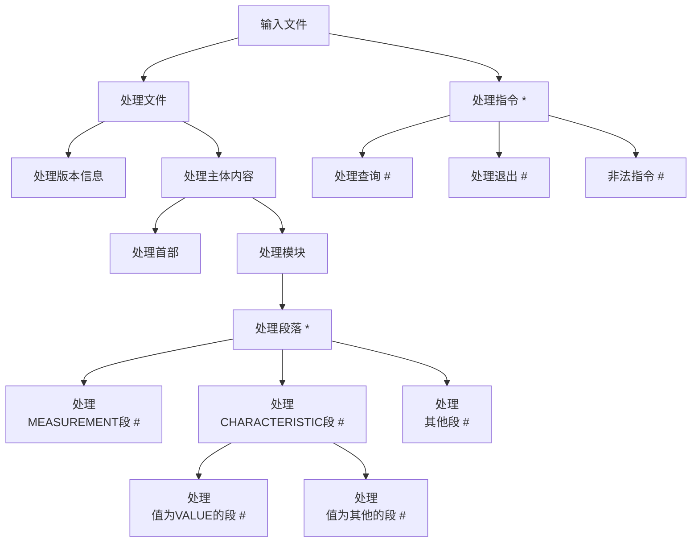

附件是一个用于嵌入式系统标定的数据文件，文件用段落的方式存储了变量的属性，现要求实现一段代码，对文件进行分析。

要求使用 Jackson 方法完成设计
给定的文件中，仅处理 MEASUREMENT 段落和 CHARACTERISTIC 且值为 value 段落中的内容 // type 是 VALUE
设计一个数据结构，使用者可以方便地通过变量的名字，访问变量的各种属性
跟据你的设计实现代码 C/C++均可。
你的设计是否兼容功能变化，比如需求改为处理所有 CHARACTERISTIC 段落的内容，你的设计需要做怎样的改变呢？说明需要修改的地方？
针对原始需求是否存在比你最初的设计更好的方案，容易地兼容变化呢？

输入：



输出



整体概要设计：



```a2l
    /begin MEASUREMENT
      /* Name                   */      av14APCoolOut
      /* Long identifier        */      "AN14"
      /* Data type              */      SLONG
      /* Conversion method      */      thothfcu100_CM_int32_mv
      /* Resolution (Not used)  */      0
      /* Accuracy (Not used)    */      0
      /* Lower limit            */      0.0
      /* Upper limit            */      6000.0
      ECU_ADDRESS                       0x400019e0
    /end MEASUREMENT

    /begin CHARACTERISTIC      
      /* Name                   */      AI_LSD_Table_Data
      /* Long Identifier        */      "LSD PWM"
      /* Characteristic Type    */      CURVE
      /* ECU Address            */      0x400540e0
      /* Record Layout          */      Lookup1D_SLONG
      /* Maxdiff                */      0
      /* Conversion Method      */      thothfcu100_CM_int32
      /* Lower Limit            */      0.0
      /* Upper Limit            */      4096.0
      /begin AXIS_DESCR                 
        /* Description of X-Axis Points */
        /* Axis Type            */      COM_AXIS
        /* Reference to Input   */      NO_INPUT_QUANTITY
        /* Conversion Method    */      thothfcu100_CM_int32
        /* Number of Axis Pts   */      4
        /* Lower Limit          */      0.0
        /* Upper Limit          */      5000.0
        AXIS_PTS_REF                    AI_LSD_Table_Bp
      /end AXIS_DESCR
    /end CHARACTERISTIC

    /begin CHARACTERISTIC
      /* Name                   */      cov_hi  
      /* Long Identifier        */      "kp"
      /* Type                   */      VALUE 
      /* ECU Address            */      0x400540c8 
      /* Record Layout          */      Scalar_FLOAT32_IEEE 
      /* Maximum Difference     */      0 
      /* Conversion Method      */      thothfcu100_CM_single 
      /* Lower Limit            */      -3.4E+38 
      /* Upper Limit            */      3.4E+38
    /end CHARACTERISTIC
```
