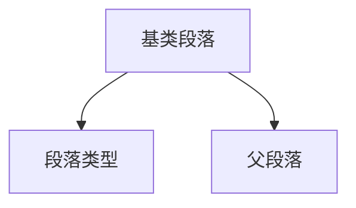
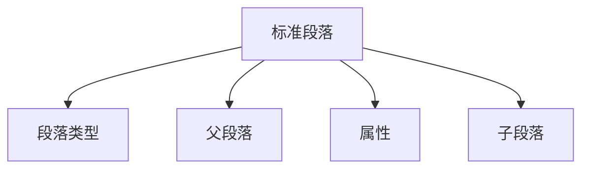
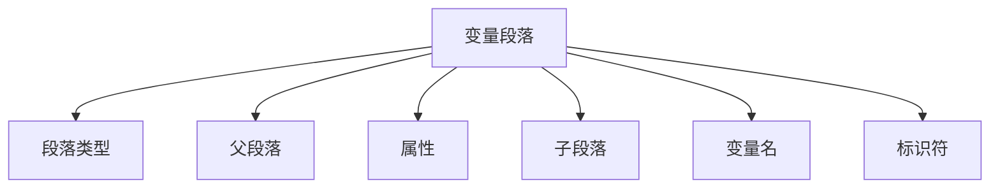
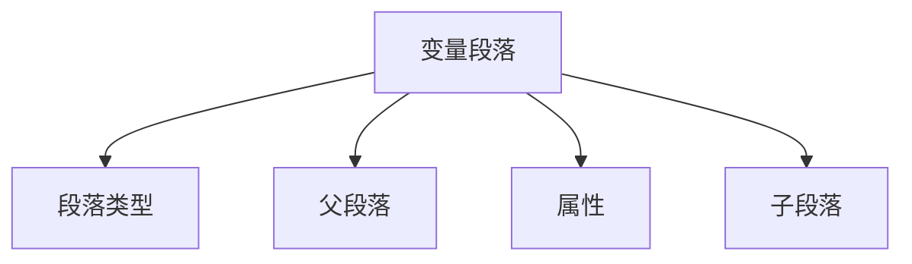

# 数据结构设计

## 1. 段落

### a. 基类

```mermaid
graph TB
    par[基类段落]
    parType[段落类型]
    parFather[父段落]
    par-->parType
    par-->parFather
```

### b. 标准段落

继承 基类

```mermaid
graph TB
    par[标准段落]
    parType[段落类型]
    parFather[父段落]
    ch[属性]
    son[子段落]
    par-->parType
    par-->parFather
    par-->ch
    par-->son
```

### c. 变量段落

继承 标准段落

```mermaid
graph TB
    par[变量段落]
    parType[段落类型]
    parFather[父段落]
    name[变量名]
    lId[标识符]
    ch[属性]
    son[子段落]
    par-->parType
    par-->parFather
    par-->ch
    par-->son
    par-->name
    par-->lId
```

### d.主段落

继承 

```mermaid
graph TB
    par[变量段落]
    parType[段落类型]
    parFather[父段落]
    ch[属性]
    son[子段落]
    par-->parType
    par-->parFather
    par-->ch
    par-->son
```
