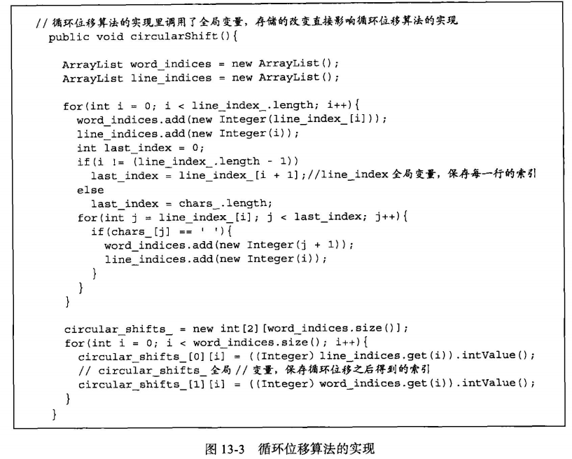
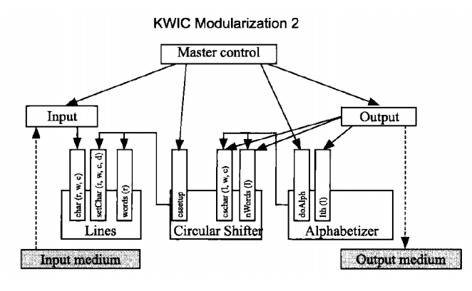
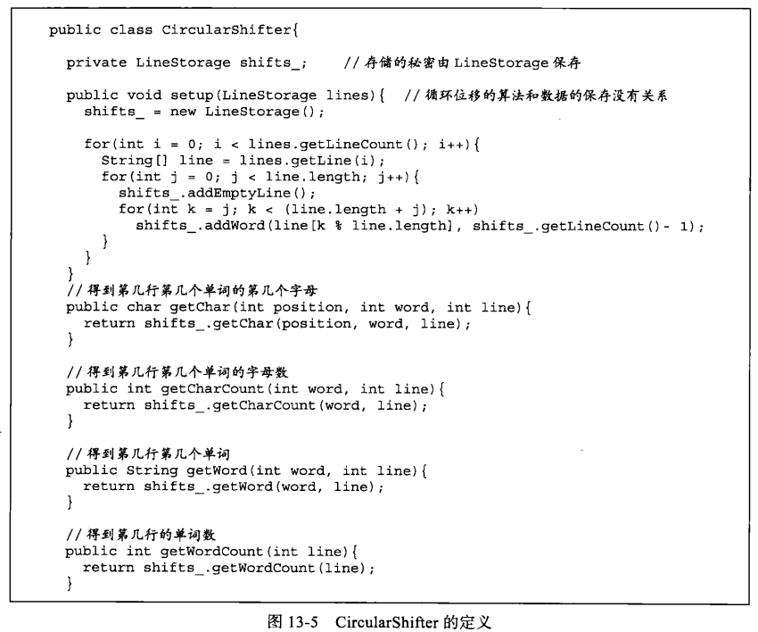

# 软件工程与计算二 作业四

## 1. 利用C++ 构造两种设计策略下的软件实现

> 要求严格遵守教材中样例代码的核心思想，即遵循已有的设计且不改变已有的代码

### (I) 算法分解

#### model1 概要

#### model1 核心算法

#### model1 代码

见[./model1](./model1/main.cpp)

### (II) 决策抽象

#### model2 概要

#### model2 核心算法

#### model2 代码

见[./model2](./model2/main.cpp)

### 随机测试

>在 test 目录下：[python test.py -m 1或者2](./test/test.py)

## 2. 基于你的实现，逐条解释表格13-3，指出需要修改哪个模块

## 3. 阅读教材13.2和13.3，并结合附件中的论文，说一说你对决策抽象策略和面向对象设计的理解
> 要求语言高度精炼，表达主要观点即可，不要长篇大论
