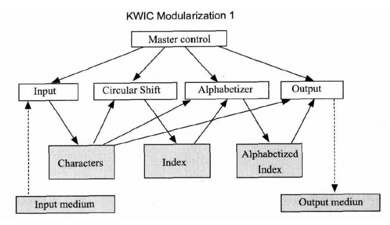

# 软件工程与计算二 作业四

[PDF 见 ./report/221900175-毛九弢-SEhw04-report.pdf](./report/221900175-毛九弢-SEhw04-report.pdf)

## 1. 利用 C++ 构造两种设计策略下的软件实现

> 要求严格遵守教材中样例代码的核心思想，即遵循已有的设计且不改变已有的代码

### (I) 算法分解

#### model1 概要

#### model1 核心算法

#### model1 代码

见[./model1](./model1/main.cpp)

### (II) 决策抽象

#### model2 概要

#### model2 核心算法

#### model2 代码

见[./model2](./model2/main.cpp)

### 随机测试

> 在 test 目录下：[python test.py -m 1 或者 2](./test/test.py)

## 2. 基于你的实现，逐条解释表格 13-3，指出需要修改哪个模块

| 变化的内容             | 按算法分解需要更改的模块                             | 按决策抽象需更改的模块 |
| ---------------------- | ---------------------------------------------------- | ---------------------- |
| 输入的形式             | input 模块                                           | input 模块             |
| 所有行都保存下来       | 所有模块                                             | lineStorage 模块       |
| 打包四个字符为一个单词 | 所有模块                                             | input 模块             |
| 使用索引来存储         | input 模块、circularShifter 模块、output 模块        | lineStorage 模块       |
| 更改排序算法           | circularShifter 模块、alphabetized 模块、output 模块 | alphabetizer 模块      |

## 3. 阅读教材 13.2 和 13.3，并结合附件中的论文，说一说你对决策抽象策略和面向对象设计的理解

> 要求语言高度精炼，表达主要观点即可，不要长篇大论

论文认为在系统模块化时，基于流程图进行分解几乎总是错误的。\
其建议首先列出设计中存在的困难决策或可能发生变化的设计决策。\
然后，将每个模块设计为隐藏这些决策，使得其他模块无法感知到这些变化。\
由于设计决策通常超越了执行时间，模块不应对应于处理过程中的步骤。\
为了实现高效的系统实现，必须放弃将模块视为一个或多个子程序的假设，而应允许子程序和程序由不同模块的代码组合而成。

### 两者的概念

1. 决策抽象：
   每个模块都隐藏一个重要的设计决策，但决策实现的细节（特别是容易改变的细节）只有该模块自己知道，并为外部定义清晰的接口以供调用。
2. 面向对象：
   强调“类”，将数据和行为封装在一起，通过关联和继承形成类与类的关系，通过继承和多态实现系统的扩展和复用。

### 两者的关系

1. 相同点
   两者都强调将变化隔离，以提高系统的可维护性和灵活性。
2. 不同侧重点
   1. 决策抽象 关注于系统的决策点，将容易改变的细节隐藏掉，通过模块化管理变化。
   2. 面向对象设计 关注于“类”，将数据和行为封装在一起，通过对象的行为来实现软件。
3. 关联
   面向对象设计可以看作是从决策抽象的层面再一次地抽象和封装。
