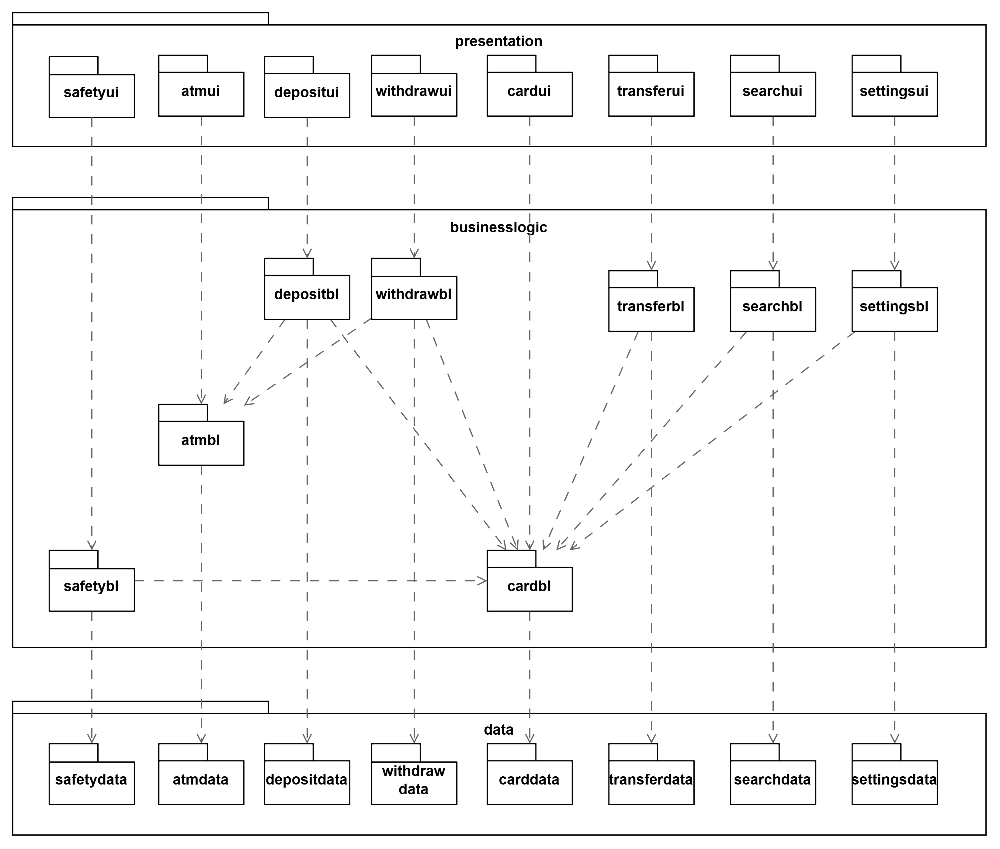

# HW5 OO 需求+设计

## （一）ATM 软件需求描述

### A 功能性需求

1. 存款
   `持卡人`可以选择`存款操作`。\
   持卡人放入`现金`，`ATM`通过验钞后，将检验失败的现金吐出，将验钞成功的`金额`显示给持卡人并要求持卡人选择继续添加、确认存款和取消存款。\
   选择取消存款，ATM 机将吐出持卡人放入的现金；选择继续添加，ATM 机将重复上述过程；选择确认存款，ATM 机将储存持卡人放入的现金，并将相应的现金存入`银行卡账户`。
2. 取款
   `持卡人`可以选择`取款操作`。\
   持卡人输入需要取出的`金额`。\
   如果输入的金额高于 `ATM` 机储存的`现金金额`或持卡人设定的`取款额度`或该`银行卡账号`的`余额`，将拒绝该取款操作；\
   反之，ATM 机将扣除持卡人银行卡账号中相应的金额，并吐出相应金额的现金。
3. 转账
   持卡人可以选择`转账操作`。\
   `持卡人`输入`收款人`的`银行卡账号`和`转账金额`。\
   如果收款人的银行卡账号不存在或收款人的银行卡不可用或转账金额超过持卡人设定的`转账额度`或转账金额超过持卡人银行卡的`账号余额`，ATM 机将拒绝该操作；\
   反之，ATM 机将扣除持卡人银行卡账号中相应的金额，并向相应银行请求将相应的现金存入收款人的银行卡账户。
4. 查询
   `持卡人`可以选择`查询操作`，查看插入的银行卡的`账号余额`。
5. `设置功能`（设置密码、转账额度和取款额度）
   `持卡人`可以选择设置`密码`或`转账额度`或`取款额度`操作。\
   持卡人输入新密码或转账额度或取款额度，并二次确认后，将成功更改密码或转账额度或取款额度。

### B 非功能性需求

1. 安全性需求
   1. 使用密码验证确保操作人是银行卡的持卡人本人

## （二）构造用例图、概念类图、顺序图和状态机图，为需求建模

### A 用例图

### B 概念图

#### 候选类

取款操作、存款操作、转账操作、查询操作、设置功能操作、银行卡、持卡人、ATM 机、密码、现金、金额、银行卡账户、ATM 储存的现金金额、账号余额、收款人、取款额度、银行卡账号、转账额度

#### 属性的候选类

账号、密码、取款额度、转账额度、余额 -> 银行卡\
现金储备 -> ATM 机\
金额 -> 取款操作\
金额 -> 存款操作\
金额 -> 转账操作\
设置属性名、输入的属性值 -> 设置功能操作

#### 被剔除的候选类

收款人，持卡人，现金，安全验证

#### 词语加工

银行卡账户 -> 银行卡\
银行卡账号 -> 账号\
ATM 储存的现金金额 -> 现金储备\
账号余额 -> 余额\
收款人->收款人账号\
设置功能操作 -> 设置操作

#### 补充问题域

#### 概念类

银行卡（账号，密码，取款额度，转账额度，余额）\
ATM 机（现金储备）\
查询操作 \
取款操作（金额）\
存款操作（金额）\
转账操作（金额）\
设置操作（设置属性名、输入的属性值）

#### 概念类图

### C 顺序图

#### 1. 取款

#### 2. 存款

#### 3. 转账

#### 4. 查询

#### 5. 设置

### D 状态机图

#### 状态机表格

| 状态             | 说明                         |
| ---------------- | ---------------------------- |
| 待机             | 没有卡的状态                 |
| 安全验证         | 插卡之后进行安全验证的状态   |
| 首页             | 进入服务界面                 |
| 安全验证错误提示 | 安全验证中发生错误的状态     |
| 余额显示         | 查询结果                     |
| 存入现金显示     | 存款进行中显示存入现金的状态 |
| 服务非法提示     | 服务中非法的提示状态         |
| 服务结束         | 主动或被动退卡状态           |

#### 状态机图

## （三）取款需求用例

| 取款     | 取款描述                                                                                                                                                                                                                                                                                                                                                                                                                                                                                                                                                                                                                                                                                                                       |
| -------- | ------------------------------------------------------------------------------------------------------------------------------------------------------------------------------------------------------------------------------------------------------------------------------------------------------------------------------------------------------------------------------------------------------------------------------------------------------------------------------------------------------------------------------------------------------------------------------------------------------------------------------------------------------------------------------------------------------------------------------ |
| 参与者   | 持卡人，目标是快速正确地完成取款操作，尤其不要出现实际取款金额错误的情况                                                                                                                                                                                                                                                                                                                                                                                                                                                                                                                                                                                                                                                       |
| 触发条件 | 持卡人选择取款操作                                                                                                                                                                                                                                                                                                                                                                                                                                                                                                                                                                                                                                                                                                             |
| 前置条件 | 持卡人以及银行卡已经过安全验证                                                                                                                                                                                                                                                                                                                                                                                                                                                                                                                                                                                                                                                                                                 |
| 后置条件 | 持卡人获得相应现金，银行卡的余额被更新                                                                                                                                                                                                                                                                                                                                                                                                                                                                                                                                                                                                                                                                                         |
| 正常流程 | 1.持卡人输入金额 2.ATM 机与服务器通讯，扣除银行卡余额 3.ATM 机吐出现金 4.持卡人拿走现金                                                                                                                                                                                                                                                                                                                                                                                                                                                                                                                                                                                                                               |
| 拓展流程 | 1a.非法金额： &emsp;1.系统提示错误并要求重新输入 2a.连接服务器失败等其他操作失败： &emsp;1.如果失败次数少于 3 次，重复正常流程 2，否则系统提示连接错误，拒绝取款操作 3a.吐出现金失败： &emsp;1.系统提示持卡人机器损坏 &emsp;2.与服务器通讯，恢复所有金额至银行卡账户。 &emsp;2a. 恢复失败： &emsp;&emsp;1.提示持卡人拨打相关服务电话 &emsp;&emsp;2.将该流程日志记录在存储器中 4a.持卡人没有取走现金或仍有现金剩余： &emsp;1.系统提示持卡人有现金未取，持续 3s &emsp;2.再次检测如果仍未取走，与服务器通讯，恢复剩余的金额至银行卡账户。 &emsp;2a. 恢复失败： &emsp;&emsp;1.向持卡人预留手机发送短信，说明情况并提醒其拨打相关服务电话 &emsp;&emsp;2.将该流程日志记录在存储器中  |

## （四）运用分层体系结构风格，进行体系结构设计，并用包图表示设计的结果

### 初步设计表

| 功能 | 逻辑包                             |
| ---- | ---------------------------------- |
| 取款 | withdrawui,withdrawbl,withdrawdata |
| 存款 | depositui,depositbl,depositdata    |
| 查询 | searchui,searchbl,searchdata       |
| 转账 | transferui,transferbl,transferdata |
| 设置 | settingsui,settingsbl,settingsdata |

### 改进设计表

取款需要，查询账号余额、取款额度
转账需要，查询余额和额度

| 功能 | 逻辑包                                                      |
| ---- | ----------------------------------------------------------- |
| 取款 | withdrawui,withdrawbl,withdrawdata   searchbl,searchdata  |
| 存款 | depositui,depositbl,depositdata                             |
| 查询 | searchui,searchbl,searchdata                                |
| 转账 | transferui,transferbl,transferdata   searchbl,searchdata   |
| 设置 | settingsui,settingsbl,settingsdata                          |

### 初步包图

### 最终包图

安全验证满足安全性

## （五）运用类图、顺序图和状态机图，描述详细设计的结果

### 关键类图

### 详细顺序图

### 详细状态机图

## 附

### 概要

我们的团队需要为南京大学银行新开发一版自动柜员机（Auto Teller Machine）软件，请运用面向对象的分析与设计方法完成系统需求分析、体系结构设计和详细设计。

1. 系统需要提供存款、取款、转账、查询和设置功能（设置密码，转账额度和取现额度）。
2. 撰写文档，用自然语言详细描述上述用户需求。
3. 针对上述需求，构造用例图、概念类图、顺序图和状态机图，为需求建模。
4. 编写用例，描述取款需求。
5. 运用分层体系结构风格，进行体系结构设计，并用包图表示设计的结果。
6. 运用类图、顺序图和状态机图，描述详细设计的结果。

### 提醒

1. 建议认真参照教材上 MSCS 的例子，准确刻画模型，这是专业人员的基本功，尽力避免模型语法上的错误。
2. 模型可以配合适当的说明，表达详细的信息。
3. 所有模型都可以手绘，拍照后编辑文档上传。
