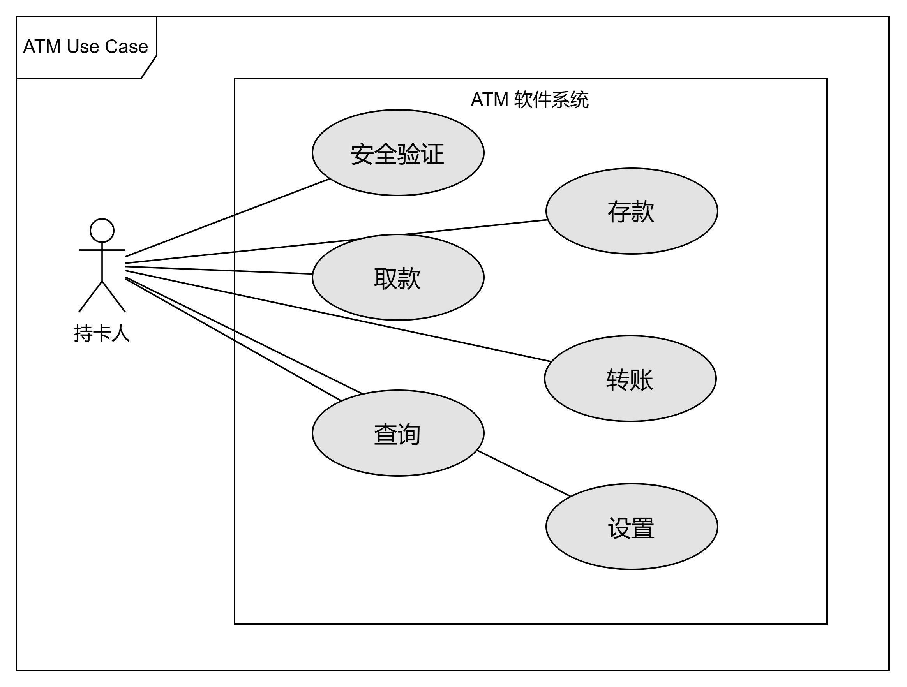

# HW5 OO 需求+设计

## （一）ATM 软件需求描述

1. 安全验证
   持有南京大学银行卡的人(下简称持卡人)，在插入南京大学银行卡后，\
   需验证银行卡有效并要求输入密码，如验证失败或输入密码失败将退卡
2. 存款
   持卡人可以选择存款操作。\
   持卡人放入现金，ATM 通过验钞后，将检验失败的现金吐出，将验钞成功的金额显示给持卡人并要求持卡人选择继续添加、确认存款和取消存款。\
   选择取消存款，ATM 机将吐出持卡人放入的现金；选择继续添加，ATM 机将重复上述过程；选择确认存款，ATM 机将储存持卡人放入的现金，并将相应的现金存入银行卡账户。
3. 取款
   持卡人可以选择取款操作。\
   持卡人输入需要取出的现金。\
   如果输入的金额高于 ATM 机储存的现金金额或持卡人设定的取现额度或该银行卡账号的余额，将拒绝该取款操作；\
   反之，ATM 机将扣除持卡人银行卡账号中相应的金额，并吐出相应金额的现金。
4. 转账
   持卡人可以选择转账操作。\
   持卡人输入收款人的银行卡账号和转账金额。\
   如果收款人的银行卡账号不存在或收款人的银行卡不可用或转账金额超过持卡人设定的转账额度或转账金额超过持卡人银行卡的账号余额，ATM 机将拒绝该操作；\
   反之，ATM 机将扣除持卡人银行卡账号中相应的金额，并向相应银行请求将相应的现金存入收款人的银行卡账户。
5. 查询
   持卡人可以选择查询操作，查看插入的银行卡的账面余额。
6. 设置功能（设置密码、转账额度和取款额度）
   持卡人可以选择设置密码或转账额度或取款额度操作。\
   持卡人输入新密码或转账额度或取款额度，并二次确认后，将成功更改密码或转账额度或取款额度。

## （二）构造用例图、概念类图、顺序图和状态机图，为需求建模

### A 用例图

### B 概念图

### C 顺序图

### D 状态机图

## （三）取款需求用例

## （四）运用分层体系结构风格，进行体系结构设计，并用包图表示设计的结果

## （五）运用类图、顺序图和状态机图，描述详细设计的结果

## 附

### 概要

我们的团队需要为南京大学银行新开发一版自动柜员机（Auto Teller Machine）软件，请运用面向对象的分析与设计方法完成系统需求分析、体系结构设计和详细设计。

1. 系统需要提供存款、取款、转账、查询和设置功能（设置密码，转账额度和取现额度）。
2. 撰写文档，用自然语言详细描述上述用户需求。
3. 针对上述需求，构造用例图、概念类图、顺序图和状态机图，为需求建模。
4. 编写用例，描述取款需求。
5. 运用分层体系结构风格，进行体系结构设计，并用包图表示设计的结果。
6. 运用类图、顺序图和状态机图，描述详细设计的结果。

### 提醒

1 建议认真参照教材上 MSCS 的例子，准确刻画模型，这是专业人员的基本功，尽力避免模型语法上的错误。 2.模型可以配合适当的说明，表达详细的信息。 3.所有模型都可以手绘，拍照后编辑文档上传。